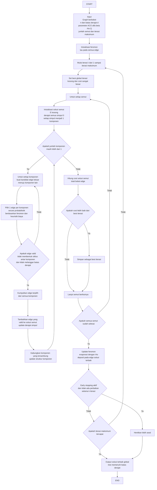

# b-ACO Borůvka Sollin untuk d-MST dengan Early Stopping

Dokumen ini merangkum **langkah-langkah b-ACO** berbasis **Borůvka atau Sollin** untuk membangun **pohon merentang** dengan **batas derajat** pada setiap simpul. Pendekatan ini memakai mekanisme ACO untuk memilih edge secara probabilistik, lalu menggabungkan komponen seperti Borůvka.

---

## Ringkasan ide

- **Borůvka atau Sollin**: membangun pohon per fase dengan memilih **satu edge keluar terbaik dari setiap komponen**, lalu **menggabungkan komponen** secara serentak.
- **ACO**: pemilihan edge tidak murni greedy, tetapi dipandu **feromon** dan **heuristik biaya**.
- **Batas derajat d**: setiap simpul tidak boleh memiliki derajat lebih dari **d**.
- **Early stopping**: berhenti lebih awal jika solusi terbaik tidak membaik selama beberapa iterasi.

---

## Input dan parameter

**Input utama**
- Graf berbobot, tidak berarah, dengan bobot non-negatif
- Jumlah simpul: **n**
- Batas derajat: **d**

**Parameter ACO**
- **alpha**: pengaruh feromon
- **beta**: pengaruh heuristik biaya
- **rho**: laju evaporasi feromon
- **Q**: konstanta deposit feromon
- **tau0**: feromon awal pada semua edge
- Jumlah semut: **mAnts**
- Iterasi maksimum: **MaxIter**

**Parameter early stopping**
- **k**: jumlah iterasi berturut-turut tanpa perbaikan
- **epsilon**: ambang perubahan kecil, jika digunakan

---

## Flowchart proses b-ACO Borůvka Sollin

---

## Langkah-langkah b-ACO Borůvka Sollin untuk d-MST

1. **Mulai**.

2. **Input**:
   - Graf berbobot
   - Jumlah simpul **n**
   - Batas derajat **d**
   - Parameter ACO: **alpha, beta, rho, Q**
   - Jumlah semut **mAnts**
   - Iterasi maksimum **MaxIter**

3. **Inisialisasi feromon**:
   - Set nilai feromon awal pada semua edge, misalnya **tau0**.

4. **Untuk setiap iterasi** dari 1 sampai **MaxIter**:
   1) Set **solusi terbaik iterasi** sebagai kosong, dan cost terbaik sebagai nilai sangat besar.  
   2) **Untuk setiap semut**:
      - a) **Inisialisasi komponen**  
        Setiap simpul dianggap sebagai 1 komponen.  
        Solusi edge **E = kosong**.  
        Derajat setiap simpul di-set 0.
      - b) **Ulangi selama jumlah komponen lebih dari 1**:
        - i) Untuk setiap komponen, buat daftar **kandidat edge** yang keluar dari komponen menuju komponen lain.
        - ii) Dari kandidat tersebut, pilih **satu edge** menggunakan probabilitas ACO yang dipandu:
          - feromon pada edge, dan
          - heuristik biaya, misalnya kebalikan bobot edge.

          Edge yang dipilih harus memenuhi syarat:
          - tidak membentuk siklus antar komponen, dan
          - tidak melanggar batas derajat:
            - derajat u + 1 tidak lebih dari d
            - derajat v + 1 tidak lebih dari d
        - iii) Kumpulkan edge terpilih dari semua komponen.
        - iv) Tambahkan edge-edge yang **valid** ke solusi.  
          Jika terjadi konflik atau duplikasi, ambil edge yang tetap valid.
        - v) **Update komponen**: gabungkan komponen yang tersambung oleh edge-edge tersebut, dan update derajat simpul.
      - c) Hitung **cost solusi semut** sebagai total bobot semua edge pada solusi.
      - d) Jika cost solusi semut lebih baik dari solusi terbaik iterasi, simpan sebagai **solusi terbaik iterasi**.

5. **Update feromon**:
   - a) **Evaporasi**: kurangi feromon pada semua edge dengan faktor **rho**.
   - b) **Deposit**: tambahkan feromon pada edge yang termasuk solusi terbaik, misalnya proporsional terhadap **Q dibagi cost**.

6. **Cek terminasi opsional**:
   - Jika solusi terbaik tidak membaik selama **k** iterasi berturut-turut, lakukan **early stopping**.

7. **Output**:
   - Solusi terbaik keseluruhan, berupa pohon dengan jumlah edge **n minus 1** dan semua simpul memenuhi batas derajat **d**.

8. **Selesai**.

---

## Catatan praktis

- Pada d-MST, banyak edge murah bisa menjadi tidak feasible karena batas derajat, jadi perlu pemeriksaan feasibility saat pemilihan edge.
- Early stopping berguna karena pada banyak kasus, perbaikan terbesar terjadi di iterasi awal, dan iterasi lanjutan sering memberi peningkatan kecil.
